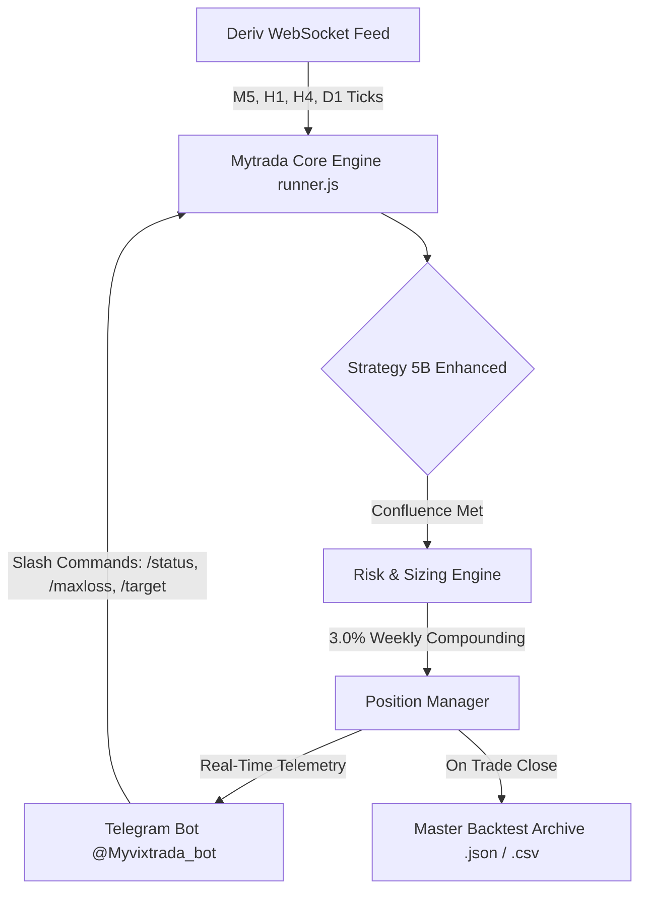

# 📖 MYTRADA PROJECT JOURNAL & WORK PROCESS HISTORY
**Project:** Mytrada Autonomous Synthetic Index Sniper  
**Core Strategy:** Strategy 5B Enhanced (Value-Zone Momentum Sniper)  
**Environment:** Deriv WebSocket API (Production VPS) & Telegram Bot Control (`@Myvixtrada_bot`)  
**Last Updated:** October 2, 2026  

---

## 🧭 Executive Summary: What We Are Working On

**Mytrada** is an institutional-grade, fully automated algorithmic trading system designed specifically for **Deriv Synthetic Crash & Boom Indices**. It connects directly to Deriv's low-latency WebSocket API (`wss://ws.derivws.com/websockets/v3`) to analyze multi-timeframe price action, detect algorithmic spike exhaustion, calculate precise entry/exit levels, execute trades, and manage active positions 24/7 with zero human emotional interference.

The system runs on a **Linux VPS under PM2** process management and provides full bi-directional **Telegram Command & Control**, delivering instant trade notifications, EOD performance audits, live equity tracking, and real-time risk administration directly from Telegram chat.



---

## 💎 Core Strategy Architecture: Strategy 5B Enhanced

All trading decisions are governed by **Strategy 5B Enhanced (Value-Zone Momentum Sniper)**, designed to exploit the mathematical phenomenon of **Algorithmic Spike Liquidity Exhaustion**:

### 1. The Core Edge
* **Synthetic Boom & Crash Dynamics:** Spikes represent sudden algorithmic liquidity surges against the natural drift of the asset.
* **Macro Trend Confluence:** When spikes occur **counter to the dominant trend** across 3 higher timeframes (**Daily 50 EMA + 4-Hour 50 EMA + 1-Hour 50 EMA**), they represent temporary liquidity exhaustion rather than true trend reversals.
* **Strict Directional Rules:**
  * **BOOM Indices:** **SELL ONLY** when Daily < EMA50, 4H < EMA50, and 1H < EMA50.
  * **CRASH Indices:** **BUY ONLY** when Daily > EMA50, 4H > EMA50, and 1H > EMA50.

### 2. 1-Candle Entry Confirmation (Preserved Decision)
* **The Rule:** The bot waits for a spike event, followed by **exactly 1 completed 5-minute counter-trend exhaustion candle** whose body is $\ge 50\%$ of its range.
* **Why 1-Candle Confirmation Was Chosen:** Entering immediately on the first confirming candle captures the lowest possible value-zone price (for Crash) or highest (for Boom). Waiting for 2 or 3 candles adds lag, worsens the entry price, widens the required Stop Loss, and increases trade duration.

### 3. Exit Mechanics & Risk Model
* **Take Profit:** Fixed **1:1.3 Risk-to-Reward (R:R)** ratio.
* **Stop Loss:** Placed beyond the spike peak + $1.5\times$ ATR buffer.
* **Lot Sizing:** Dynamically computed from Stop Loss distance to ensure exact $3.0\%$ account risk per trade.
* **Weekly End-of-Week (EOW) Compounding:** Account equity is re-anchored once per week (Sunday 00:00 UTC). Risk in dollars ($) remains fixed throughout the trading week based on this anchor, eliminating intraday sizing fluctuations and protecting the account from drawdown compounding.

---

## 🛡️ Risk Management & Safety Shields

Mytrada incorporates a multi-tiered defense framework to protect capital:

| Shield Component | Mechanism | Configuration / Command | Purpose |
| :--- | :--- | :--- | :--- |
| **Pair Circuit Breaker** | 2-Loss Daily Cap per Pair | Automatic (Hardcoded) | Prevents a single choppy asset from taking repeated losses. Halted until midnight UTC+1. |
| **Dynamic Daily Max Loss** | Account Equity Floor | `/maxloss <amount>` or `/maxloss <%>` | Halts the entire bot if today's net realized losses hit the user's set dollar threshold. (Default: 0 / Disabled). |
| **Dynamic Profit Target** | Daily Profit Cap | `/target <amount>` | Automatically locks in gains and pauses trading when the daily profit target is reached. |
| **Post-Win Cooldown** | 35-Minute Pause | Automatic per symbol | Prevents re-entering extended runs immediately after a winning trade. |
| **Portfolio Pause** | Manual Killswitch | `/pause` & `/resume` | Allows immediate manual trading halts via Telegram with full state preservation. |

---

## 📈 Monitored Universe: 12 Elite Pairs + 2 Incubation Pairs

The monitored assets were determined through extensive multi-month backtesting and live session audits:

### Production Pairs (Live Trading Active)
* **Crash Universe (7 Pairs):** `CRASH1000`, `CRASH900`, `CRASH600`, `CRASH500`, `CRASH300N`, `CRASH200`, `CRASH50`
* **Boom Universe (5 Pairs):** `BOOM1000`, `BOOM900`, `BOOM600`, `BOOM500`, `BOOM300N`, `BOOM100`

### Incubation Sandbox (Paper Tracking Only)
* `BOOM150N` and `CRASH150N` are continuously scanned. When setups form, signals and outcomes are logged to `cache/incubation_history.json` without executing real capital, allowing validation before promotion to production.

---

## 📜 Chronological Work History & Key Milestones

This chronological record documents the evolution of our work, experiments conducted, forensic audits, and engineering fixes:

### Phase 1: Strategy Formulation & Discovery (August – Early September 2026)
* Formulated and backtested Strategies 1 through 5A exploring various consecutive spike counts (2-spike vs 3-spike), RSI extreme filters, and 1H chop filters.
* Identified **Strategy 5B (Momentum Model)** as the clear outperformer with the highest baseline expectancy.
* Established the 12-pair elite universe based on 30-day multi-timeframe tick backtests.

### Phase 2: Production VPS Deployment & Weekly Compounding (Mid September 2026)
* Migrated from local execution to a dedicated Linux VPS under PM2 process supervision (`pm2 start runner.js --name mytrada`).
* Upgraded the risk sizing engine from a static $3.00 flat risk to the **Weekly End-of-Week (EOW) 3.0% Auto-Compounding Engine**, allowing the bot to safely scale as the account balance grows from $100 to thousands without intraday sizing swings.
* Integrated the **Telegram Control Bot** (`telegramBot.js`) with native slash commands and real-time execution cards.

### Phase 3: The 1-Hour Candle Guard Experiment & Counterfactual Audit (Late September 2026)
* **The Hypothesis:** Adding an active 1-hour candle guard to block setups if the current 1H candle was moving counter-trend might filter out choppy trades.
* **The Implementation:** Added guard logic and a background "Shadow Audit" engine (`checkShadowTradesForSymbol`) to track whether blocked trades would have won or lost.
* **The Forensic Finding:** Counterfactual analysis proved that the 1H candle guard was **overfiltering**—blocking high-probability, clean winning trades and causing a net negative alpha (+$195.66 USD in potential wins was blocked vs -$58.71 USD in prevented losses).
* **The Decision:** Removed the active 1H candle guard from entry detection (`detectStrategy5BSetup`) and silenced shadow audit alerts from Telegram to maintain trade frequency and edge purity.

### Phase 4: October 1 Drawdown & Circuit Breaker Bug Investigation (October 1–2, 2026)
* **The Incident:** On October 1, the bot experienced an unexpected drawdown day where `CRASH1000` took 9 trades (4W / 5L) and `CRASH900` took 7 trades (3W / 4L), clearly exceeding the intended 2-loss daily circuit breaker limit.
* **Forensic Root Cause Analysis:**
  * Investigation of `runner.js` revealed that calling `/resume` executed:
    ```javascript
    circuitBreakerState = { date: today, symbols: {} };
    ```
  * Every time the bot was resumed or restarted, the `symbols` loss history was completely wiped clean. Pairs that had already hit their 2-loss daily limit were reset to 0 losses, allowing them to repeatedly re-enter the choppy market.
* **The Fix:** Rewrote `resumeBot()` to strictly preserve `rec.dailyLosses` and maintain `pauseUntil` lockouts for any pair with $\ge 2$ losses on the calendar day.
* **Entry Confirmation Confirmation:** Preserved the 1-candle confirmation rule (`CONFIRMATION_CANDLES: 1`) after confirming that overtrading was caused by the `/resume` reset bug, not by early candle entry.

### Phase 5: Dynamic Daily Max Loss Shield & Permanent Trade Archive (October 2, 2026)
* **Dynamic Daily Max Loss (`/maxloss`):**
  * Added `/maxloss <amount>` to allow the trader to dynamically set a maximum daily loss floor (e.g. `/maxloss 200` or `/maxloss 6%`).
  * Default is 0 (disabled), giving full manual control to the user.
  * Evaluates net realized daily PnL: as long as the account is positive or growing, it will never pause; it only locks trading if the account drops below the user's defined floor.
* **Cleaned Up Telegram Reporting:** Silenced shadow audit spam and removed counterfactual audit sections from the midnight EOD performance reports.
* **Master Trade Archive for Backtesting:** Built persistent JSON and CSV trade archives (`data/trades_master_backtest_archive.json` and `.csv`) and synchronized `reportManager.js` to automatically log every trade taken.

---

## 💾 Trade Archive & Backtesting Data System

All trades ever taken or closed by Mytrada are permanently recorded in standard backtesting format:

### Storage Files
1. **JSON Master Archive:** [`data/trades_master_backtest_archive.json`](file:///c:/Users/user/Desktop/My-Projects/Active-projects/Mytrada/data/trades_master_backtest_archive.json)  
   Contains full object records with `setupId`, `date`, `time`, `symbol`, `type`, `entryPrice`, `stopLoss`, `takeProfit`, `exitPrice`, `outcome`, `pnlUSD`, `pnlR`, `confluenceScore`, and `strategy`.
2. **CSV Master Archive:** [`data/trades_master_backtest_archive.csv`](file:///c:/Users/user/Desktop/My-Projects/Active-projects/Mytrada/data/trades_master_backtest_archive.csv)  
   Clean tabular format directly importable into Python (Pandas), Excel, R, or TradingView for quantitative analysis.

### Automatic Synchronization
* In [`reportManager.js`](file:///c:/Users/user/Desktop/My-Projects/Active-projects/Mytrada/reportManager.js), the `recordClose()` function automatically updates both archives whenever a live position hits Take Profit, Stop Loss, or Breakeven.
* To manually sync or regenerate the archive at any time, run:
  ```bash
  node exportTradesForBacktest.js
  ```

---

## 📱 Telegram Command & Control Reference (`@Myvixtrada_bot`)

| Command | Arguments | Description | Example |
| :--- | :--- | :--- | :--- |
| `/status` | None | Shows live bot status, active symbols, circuit breaker states, and open trades. | `/status` |
| `/trades` | None | Lists all currently open market positions with live entry, SL, and TP levels. | `/trades` |
| `/summary` | None | Displays today's net PnL, win/loss breakdown, win rate, and realized R-multiples. | `/summary` |
| `/target` | `<amount>` / `off` | Sets or clears today's daily profit target. Bot locks once hit. | `/target 300` |
| `/maxloss` | `<amount>` / `<%>` / `off` | Sets or clears today's maximum daily loss floor. Bot halts if breached. | `/maxloss 200` |
| `/pause` | None | Temporarily freezes scanning and prevents new entries. | `/pause` |
| `/resume` | None | Resumes scanning while strictly honoring existing pair circuit breakers. | `/resume` |
| `/close` | `<symbol>` / `ALL` | Manually closes an active trade at the current market price. | `/close CRASH1000` |
| `/pairs` | None | Lists all 12 monitored pairs and their current 4H/1H trend directions. | `/pairs` |
| `/help` | None | Displays the interactive slash command menu and usage examples. | `/help` |

---

## 🛠️ Codebase Architecture & File Guide

```
Mytrada/
├── config.js               # Central configuration (Risk %, universe, endpoints, timeframes)
├── runner.js               # Main trading engine (WebSocket handler, order executor, circuit breakers)
├── telegramBot.js          # Telegram bot listener, command router, and broadcast card generator
├── reportManager.js        # Performance tracker, EOD/Weekly reporting, and trade archiving
├── exportTradesForBacktest.js # Standalone utility to compile all trades into JSON & CSV
├── marketStructure.js      # Technical analysis library (EMA, ATR, swing points, spike detection)
├── tradeExecutor.js        # Deriv order placement, lot size calculations, and tick listener
├── dataFetcher.js          # Historical candle fetcher with robust retry mechanisms
├── PROJECT_JOURNAL.md      # Master project journal, history of work, and operational runbook
├── data/
│   ├── trades_master_backtest_archive.json # Permanent trade archive for quantitative backtesting
│   └── trades_master_backtest_archive.csv  # CSV trade archive for Excel/Python
└── cache/                  # Runtime state (circuit breakers, active trades, weekly anchor)
```

---

## 🚀 Operational Runbook: How to Operate Mytrada

### 1. Running Locally (Testing / Auditing)
```bash
cd c:\Users\user\Desktop\My-Projects\Active-projects\Mytrada
node runner.js
```

### 2. Updating & Deploying to the Production VPS
When new code is pushed to GitHub, apply changes on the VPS via SSH:
```bash
cd ~/Mytrada
git pull origin main
pm2 restart 3
pm2 logs mytrada --lines 50
```

### 3. Stepping Away & Returning
* If you are away for a week or month:
  1. Open [`PROJECT_JOURNAL.md`](file:///c:/Users/user/Desktop/My-Projects/Active-projects/Mytrada/PROJECT_JOURNAL.md) (this document) to review the exact rules and state of the system.
  2. Send `/status` and `/summary` to `@Myvixtrada_bot` on Telegram to see current equity, open trades, and today's performance.
  3. Run `node exportTradesForBacktest.js` to inspect recent trade performance.
