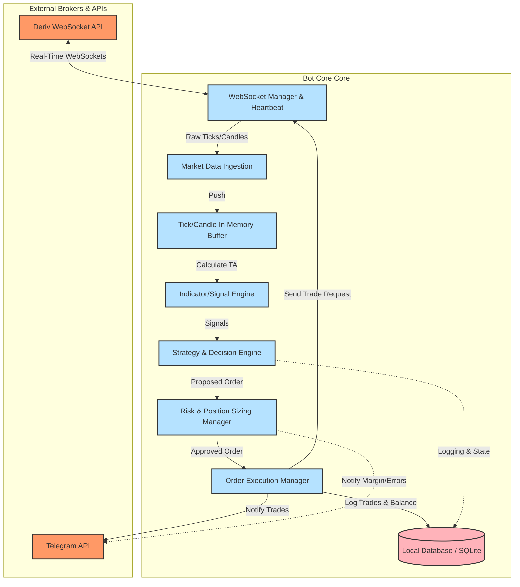

# Volatility Trading Bot Architecture (Deriv Synthetic Indices)

This document outlines the architectural blueprint for building an automated, high-frequency/real-time trading bot designed to trade **Deriv's Synthetic Volatility Indices** (VIX 100, VIX 50 (1s), VIX 75, etc.). 

Since these markets operate 24/7/365 and stream live tick data every 1–2 seconds, a resilient, event-driven, low-latency architecture is paramount.

---

## 1. High-Level Architectural Flow

Below is the event-driven data flow, from real-time tick consumption to execution and notifications:

---

## 2. Deep Dive: Component Breakdown

### 📡 A. Broker & API Connection Layer
* **WebSocket Client:** Deriv’s backend is purely WebSocket-driven. The bot must establish a persistent connection (`wss://ws.derivws.com/websockets/v3?app_id=YOUR_APP_ID`).
* **Heartbeat & Reconnection:** Must send a `ping` request every 30 seconds to maintain the WebSocket channel and implement **Exponential Backoff Reconnection** to handle sudden network dropouts without dropping execution states.
* **Authentication Handler:** Sends an `authorize` request upon startup using securely stored API Tokens.

### 📊 B. Market Data Ingestion & TA Engine
* **Subscription Manager:** Subscribes to specific tick streams (e.g., `R_100` for VIX 100, `1HZ50V` for VIX 50 1s) or candles (`ticks_history`).
* **OHLCV Aggregator:** Constructs live 1-minute, 5-minute, or 15-minute candles dynamically from live tick streams (or subscribes directly to candle updates).
* **In-Memory Time-Series Buffer:** A circular buffer (Deque) that maintains the last $N$ candles/ticks to calculate technical indicators without hitting a database.
* **Technical Analysis (TA) Engine:** Computes real-time indicators (EMA, RSI, MACD, Bollinger Bands, ATR, or Custom Smart Money Indicators) on every new tick/candle.

### 🧠 C. Strategy & Decision Engine
* **State Machine:** Tracks the bot’s current state (IDLE, ANALYZING, IN_POSITION, WAITING_COOLDOWN).
* **Signal Generator:** Evaluates indicators against rules (e.g., RSI Oversold + Bullish Engulfing + EMA crossover) to emit `BUY_RISE` or `BUY_FALL` signals.
* **Cooldown / Multi-Trade Inhibitor:** Prevents double-triggering or over-trading in volatile sideways ranges.

### 🛡️ D. Risk & Money Management (Crucial)
* **Position Sizer:** Computes execution stake dynamically based on the current balance:
  * **Percentage Risk:** E.g., Risk exactly 1% of account balance per trade.
  * **Martingale / Anti-Martingale:** Optional sizing progressions (to be used with extreme caution).
* **Dynamic Stop-Loss (SL) & Take-Profit (TP):** Calculates exit barriers using **Average True Range (ATR)** or structure-based swings.
* **Max Drawdown Limit:** Auto-suspends trading if daily or weekly drawdown targets are hit.

### ⚡ E. Execution & Order Manager
* **Contract Buyer:** Subscribes to `buy` responses to confirm order execution and matches returned `contract_id` values.
* **Active Position Monitor:** Tracks live contracts, monitoring when they hit SL/TP barriers or expire (for Durations/Ticks trades).
* **State Sync:** Ensures local order status matches Deriv's server state at all times.

---

## 3. Technology Stack Options

You have two primary tech stack pathways depending on your focus:

| Feature | 🐍 Python Stack (Data & Math First) | 🟢 Node.js / TypeScript Stack (Real-Time First) |
| :--- | :--- | :--- |
| **Primary Libraries** | `websockets`, `pandas`, `pandas-ta`, `sqlite3` | `ws`, `deriv-api`, `talib` or `technicalindicators`, `sqlite3` |
| **Strengths** | - Massive library of pre-built TA indicators (`pandas-ta`). - Easy implementation of machine learning/AI trading models. - Rapid mathematical prototyping. | - Native asynchronous event loop (extremely fast WebSocket speed). - Type safety with TypeScript. - Simple to build a premium web-based dashboard dashboard later. |
| **Complexity** | Low-to-Medium | Medium (requires async/promise chain handling) |

---

## 4. Key Failure Modes to Architect Against

1. **WebSocket Disconnection during Trade Execution:** 
   * *Mitigation:* The database must store the unique `contract_id` immediately upon submission. On reconnect, the bot queries `portfolio` or `statement` to check the actual state of that contract.
2. **API Rate Limiting:**
   * *Mitigation:* Deriv limits requests per second. The bot must implement an outbound request queue with throttling to prevent IP blocking.
3. **Execution Latency:**
   * *Mitigation:* Keep the TA engine processing lean. Do not run heavy database writes synchronously before executing orders.
4. **Whipsaw Markets (False Breakouts):**
   * *Mitigation:* Integrate volatility filters (like ADX or ATR thresholding) to turn off trading during low-volatility consolidation.

---

## 5. Proposed Next Steps

To begin building, we can execute the project in modular phases:

1. **Phase 1 (Infrastructure):** Set up the directory structure, configure environment variables, and build the resilient WebSocket Manager.
2. **Phase 2 (Data & Indicators):** Stream live ticks/candles and print real-time calculated indicator values (RSI, EMA, etc.) to verify mathematical alignment.
3. **Phase 3 (Execution & Logic):** Implement dummy trade routing on **Deriv Demo Account** and establish secure authentication.
4. **Phase 4 (Risk & Notifications):** Build the position-sizing logic and add Telegram/Discord webhook notifications.
5. **Phase 5 (Dashboard - Optional):** Build a stunning modern dark-mode companion dashboard to monitor and control your bot via your web browser.
